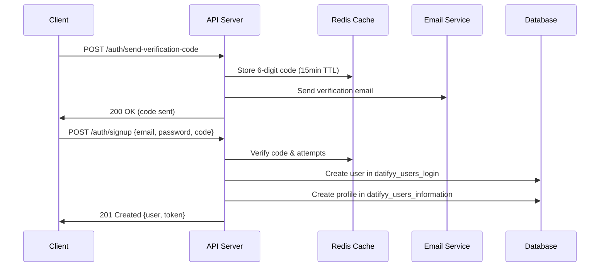
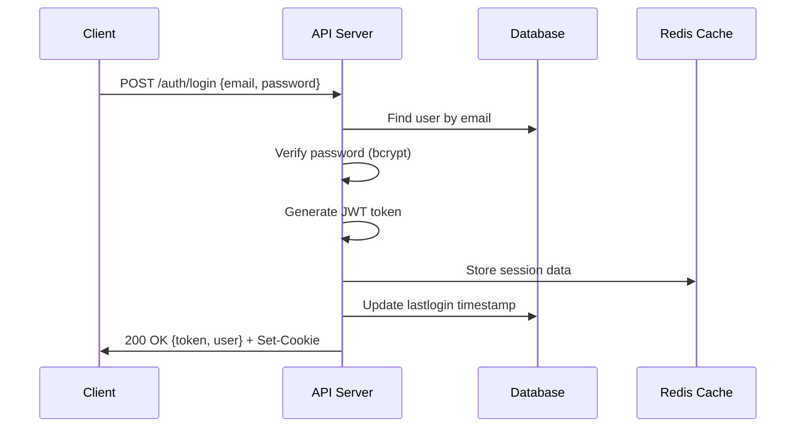
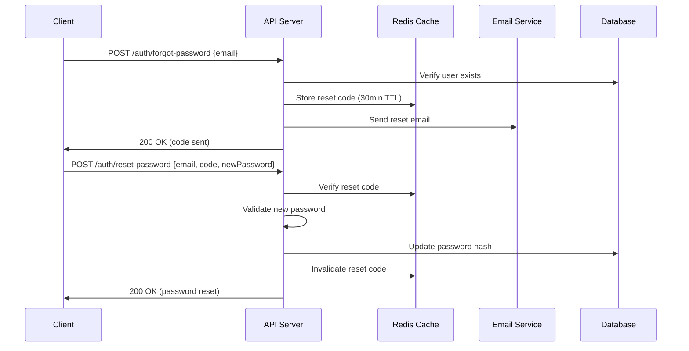

# Authentication & Session Management - Datifyy Dating App

## Overview
Datifyy implements a multi-layered authentication system with email verification, JWT tokens, and progressive verification levels. The system supports both user and admin authentication with comprehensive security measures.

## Authentication Architecture

### 1. Authentication Flow Types

#### Standard User Registration Flow


#### Login Authentication Flow


### 2. Token Management System

#### JWT Token Structure
```typescript
interface JWTPayload {
  id: number;           // User ID from datifyy_users_login
  email: string;        // User email
  isadmin: boolean;     // Admin flag
  iat: number;          // Issued at
  exp: number;          // Expires at (48h default)
}
```

#### Token Storage Strategy
1. **HTTP-Only Cookies**: Primary token storage (XSS protection)
2. **Authorization Header**: Fallback for API clients
3. **Redis Session Store**: Server-side session tracking
4. **Token Rotation**: Automatic refresh on activity

#### Token Validation Middleware
```typescript
// src/infrastructure/middleware/authentication.ts
export function authenticate() {
  return async (req: Request, res: Response, next: NextFunction) => {
    try {
      // 1. Extract token from cookie or header
      const token = extractToken(req);
      
      // 2. Verify JWT signature and expiration
      const decoded = jwt.verify(token, JWT_SECRET) as JWTPayload;
      
      // 3. Load user from database with profile
      const user = await userRepository.findOne({
        where: { id: decoded.id, isactive: true }
      });
      
      // 4. Attach user to request context
      req.user = {
        id: user.id,
        email: user.email,
        isAdmin: user.isadmin,
        profile: userProfile
      };
      
      next();
    } catch (error) {
      // Handle token expiration, invalid tokens
      next(new AuthenticationError('Invalid or expired token'));
    }
  };
}
```

### 3. Verification System

#### Multi-Level Verification
Datifyy implements progressive verification for enhanced trust and features.

```typescript
interface VerificationStatus {
  email: {
    status: boolean;
    verifiedAt: Date;
    method: 'email_code';
  };
  phone: {
    status: boolean;
    verifiedAt: Date;
    method: 'sms_code';
  };
  identity: {
    status: boolean;
    verifiedAt: Date;
    method: 'aadhar_document';
  };
}
```

#### Email Verification Flow
```typescript
// Email verification with Redis-based code storage
export class RedisVerificationCodeService {
  private readonly EMAIL_VERIFICATION_TTL = 15 * 60; // 15 minutes
  private readonly MAX_ATTEMPTS = 5;
  
  async generateEmailVerificationCode(email: string): Promise<string> {
    const code = this.generateSixDigitCode();
    const key = `email_verification:${email.toLowerCase()}`;
    
    const codeData = {
      code,
      attempts: 0,
      createdAt: Date.now(),
    };
    
    await this.redisClient.setex(key, this.EMAIL_VERIFICATION_TTL, JSON.stringify(codeData));
    return code;
  }
  
  async verifyEmailCode(email: string, code: string): Promise<boolean> {
    const key = `email_verification:${email.toLowerCase()}`;
    const storedData = await this.redisClient.get(key);
    
    if (!storedData) {
      throw new VerificationCodeExpiredError();
    }
    
    const codeData = JSON.parse(storedData);
    codeData.attempts++;
    
    if (codeData.attempts > this.MAX_ATTEMPTS) {
      await this.redisClient.del(key);
      throw new InvalidVerificationCodeError('Too many attempts');
    }
    
    if (codeData.code !== code) {
      await this.redisClient.setex(key, this.EMAIL_VERIFICATION_TTL, JSON.stringify(codeData));
      throw new InvalidVerificationCodeError(`Invalid code. ${this.MAX_ATTEMPTS - codeData.attempts} attempts remaining`);
    }
    
    // Valid code - remove from cache
    await this.redisClient.del(key);
    return true;
  }
}
```

### 4. Password Management

#### Password Security
```typescript
// Password requirements and hashing
export class PasswordService {
  private readonly SALT_ROUNDS = 12;
  
  validatePassword(password: string): ValidationResult {
    const errors: string[] = [];
    
    if (password.length < 8) errors.push('Minimum 8 characters required');
    if (!/[a-z]/.test(password)) errors.push('Must contain lowercase letter');
    if (!/[A-Z]/.test(password)) errors.push('Must contain uppercase letter');
    if (!/\d/.test(password)) errors.push('Must contain number');
    if (!/[!@#$%^&*(),.?":{}|<>]/.test(password)) errors.push('Must contain special character');
    
    return { isValid: errors.length === 0, errors };
  }
  
  async hashPassword(password: string): Promise<string> {
    return bcrypt.hash(password, this.SALT_ROUNDS);
  }
  
  async verifyPassword(password: string, hash: string): Promise<boolean> {
    return bcrypt.compare(password, hash);
  }
}
```

#### Forgot Password Flow


### 5. Authorization & Access Control

#### Permission Levels
```typescript
enum UserRole {
  USER = 'user',
  ADMIN = 'admin',
  SUPER_ADMIN = 'super_admin'
}

interface UserPermissions {
  canViewAllProfiles: boolean;
  canModerateContent: boolean;
  canManageEvents: boolean;
  canAccessAnalytics: boolean;
  canManageUsers: boolean;
  canProcessRefunds: boolean;
}
```

#### Authorization Middleware
```typescript
// Role-based access control
export function requireAdmin() {
  return (req: AuthenticatedRequest, res: Response, next: NextFunction) => {
    if (!req.user?.isAdmin) {
      throw new AuthorizationError('Admin privileges required');
    }
    next();
  };
}

export function requireRole(roles: UserRole[]) {
  return (req: AuthenticatedRequest, res: Response, next: NextFunction) => {
    const userRole = req.user?.isAdmin ? UserRole.ADMIN : UserRole.USER;
    
    if (!roles.includes(userRole)) {
      throw new AuthorizationError(`Required role: ${roles.join(' or ')}`);
    }
    next();
  };
}
```

### 6. Session Management

#### Session Architecture
```typescript
interface UserSession {
  sessionId: string;
  userId: number;
  email: string;
  loginTime: Date;
  lastActivity: Date;
  ipAddress: string;
  userAgent: string;
  isActive: boolean;
  expiresAt: Date;
}
```

#### Redis Session Store
```typescript
export class RedisSessionManager {
  private readonly SESSION_TTL = 48 * 60 * 60; // 48 hours
  
  async createSession(user: AuthenticatedUser, metadata: SessionMetadata): Promise<string> {
    const sessionId = uuidv4();
    const session: UserSession = {
      sessionId,
      userId: user.id,
      email: user.email,
      loginTime: new Date(),
      lastActivity: new Date(),
      ipAddress: metadata.ipAddress,
      userAgent: metadata.userAgent,
      isActive: true,
      expiresAt: new Date(Date.now() + this.SESSION_TTL * 1000)
    };
    
    await this.redisClient.setex(
      `session:${sessionId}`,
      this.SESSION_TTL,
      JSON.stringify(session)
    );
    
    return sessionId;
  }
  
  async validateSession(sessionId: string): Promise<UserSession | null> {
    const sessionData = await this.redisClient.get(`session:${sessionId}`);
    
    if (!sessionData) return null;
    
    const session = JSON.parse(sessionData);
    
    // Update last activity
    session.lastActivity = new Date();
    await this.redisClient.setex(
      `session:${sessionId}`,
      this.SESSION_TTL,
      JSON.stringify(session)
    );
    
    return session;
  }
  
  async invalidateSession(sessionId: string): Promise<void> {
    await this.redisClient.del(`session:${sessionId}`);
  }
}
```

### 7. Security Features

#### Rate Limiting
```typescript
// Authentication rate limiting
export const authRateLimiter = createRateLimiter({
  windowMs: 15 * 60 * 1000, // 15 minutes
  max: 5, // 5 attempts per window
  message: 'Too many authentication attempts, please try again later.'
});

// General API rate limiting
export const apiRateLimiter = createRateLimiter({
  windowMs: 15 * 60 * 1000,
  max: 100 // 100 requests per window
});
```

#### CORS Configuration
```typescript
const corsOptions: CorsOptions = {
  origin: (origin, callback) => {
    const allowedOrigins = [
      'https://datifyy.com',
      'http://localhost:3000'
    ];
    
    if (!origin || allowedOrigins.includes(origin) || /\.vercel\.app$/.test(origin)) {
      callback(null, true);
    } else {
      callback(new Error('Not allowed by CORS'));
    }
  },
  credentials: true,
  allowedHeaders: ['Content-Type', 'Authorization', 'X-Request-ID'],
  methods: ['GET', 'POST', 'PUT', 'DELETE', 'PATCH', 'OPTIONS']
};
```

#### Request Security
```typescript
// Security middleware stack
app.use(helmet()); // Security headers
app.use(compression()); // Response compression
app.use(requestId()); // Request tracking
app.use(rateLimiter); // Rate limiting
app.use(cors(corsOptions)); // CORS policy
app.use(cookieParser()); // Cookie parsing
app.use(requestLogger()); // Request logging
```

### 8. Error Handling

#### Authentication Errors
```typescript
export class AuthenticationError extends BaseError {
  constructor(message = 'Authentication failed') {
    super(message, 401, 'AUTHENTICATION_ERROR');
  }
}

export class AuthorizationError extends BaseError {
  constructor(message = 'Access denied') {
    super(message, 403, 'AUTHORIZATION_ERROR');
  }
}

export class VerificationCodeExpiredError extends BaseError {
  constructor(message = 'Verification code expired') {
    super(message, 400, 'CODE_EXPIRED');
  }
}
```

#### Error Response Format
```typescript
interface AuthErrorResponse {
  success: false;
  error: {
    message: string;
    code: 'AUTHENTICATION_ERROR' | 'AUTHORIZATION_ERROR' | 'CODE_EXPIRED';
    timestamp: string;
    requestId: string;
    retryAfter?: number; // For rate limiting
  };
}
```

### 9. Monitoring & Analytics

#### Authentication Metrics
- Login success/failure rates
- Password reset frequency
- Verification completion rates
- Session duration analytics
- Failed authentication patterns
- Geographic login distribution

#### Security Monitoring
- Suspicious login attempts
- Multiple failed verifications
- Unusual access patterns
- Token abuse detection
- Session hijacking attempts

### 10. Integration Points

#### External Authentication (Future)
- Google OAuth2 integration
- Facebook Login support
- Apple Sign-in compatibility
- Phone number authentication (OTP)

#### Admin Dashboard Integration
- User session management
- Verification status overview
- Security incident monitoring
- Authentication analytics
- Manual account verification